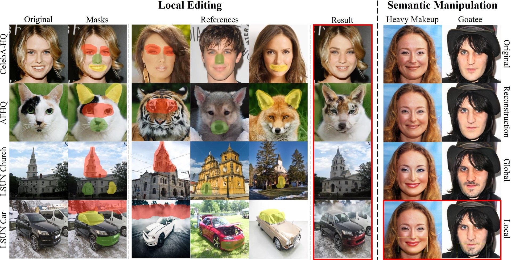
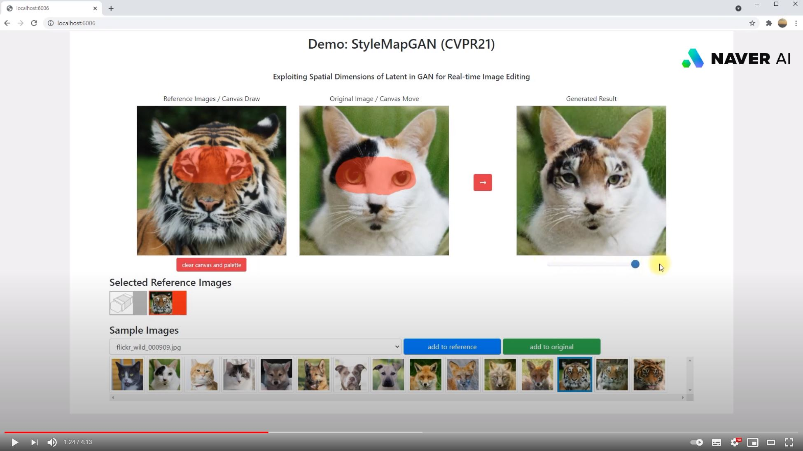

## StyleMapGAN - Official PyTorch Implementation

<p align="left"></p>

> **StyleMapGAN: Exploiting Spatial Dimensions of Latent in GAN for Real-time Image Editing**<br>
> [Hyunsu Kim](https://github.com/blandocs), [Yunjey Choi](https://github.com/yunjey), [Junho Kim](https://github.com/taki0112), [Sungjoo Yoo](http://cmalab.snu.ac.kr), [Youngjung Uh](https://github.com/youngjung)<br>
> In CVPR 2021.<br>

> Paper: https://arxiv.org/abs/2104.14754 <br>
> 5-minute video (CVPR): https://www.youtube.com/watch?v=7sJqjm1qazk <br>
> Demo video: https://youtu.be/qCapNyRA_Ng <br>

> **Abstract:** *Generative adversarial networks (GANs) synthesize realistic images from random latent vectors. Although manipulating the latent vectors controls the synthesized outputs, editing real images with GANs suffers from i) time-consuming optimization for projecting real images to the latent vectors, ii) or inaccurate embedding through an encoder. We propose StyleMapGAN: the intermediate latent space has spatial dimensions, and a spatially variant modulation replaces AdaIN. It makes the embedding through an encoder more accurate than existing optimization-based methods while maintaining the properties of GANs. Experimental results demonstrate that our method significantly outperforms state-of-the-art models in various image manipulation tasks such as local editing and image interpolation. Last but not least, conventional editing methods on GANs are still valid on our StyleMapGAN. Source code is available at https://github.com/naver-ai/StyleMapGAN.*

## Demo

<b>Youtube video</b>
Click the figure to watch the teaser video.


<p align="left"><a target="_blank" rel="noopener noreferrer" href="https://youtu.be/qCapNyRA_Ng"></a></p>

<b>Interactive demo app</b>
Run demo in your local machine.

All test images are from [CelebA-HQ](https://arxiv.org/abs/1710.10196), [AFHQ](https://arxiv.org/abs/1912.01865), and [LSUN](https://www.yf.io/p/lsun).

```bash
python demo.py --ckpt expr/checkpoints/celeba_hq_256_8x8.pt --dataset celeba_hq
```

## Installation

       


Clone this repository:

```bash
git clone https://github.com/naver-ai/StyleMapGAN.git
cd StyleMapGAN/
```

Install the dependencies:
```bash
conda create -y -n stylemapgan python=3.6.12
conda activate stylemapgan
./install.sh
```

## Datasets and pre-trained networks
We provide a script to download datasets used in StyleMapGAN and the corresponding pre-trained networks. The datasets and network checkpoints will be downloaded and stored in the `data` and `expr/checkpoints` directories, respectively.

<b>CelebA-HQ.</b> To download the CelebA-HQ dataset and parse it, run the following commands:

```bash
# Download raw images and create LMDB datasets using them
# Additional files are also downloaded for local editing
bash download.sh create-lmdb-dataset celeba_hq

# Download the pretrained network (256x256) 
bash download.sh download-pretrained-network-256 celeba_hq # 20M-image-trained models
bash download.sh download-pretrained-network-256 celeba_hq_5M # 5M-image-trained models used in our paper for comparison with other baselines and for ablation studies.

# Download the pretrained network (1024x1024 image / 16x16 stylemap / Light version of Generator)
bash download.sh download-pretrained-network-1024 ffhq_16x16
```

<b>AFHQ.</b> For AFHQ, change above commands from 'celeba_hq' to 'afhq'.


## Train network
Implemented using DistributedDataParallel.

```bash
# CelebA-HQ
python train.py --dataset celeba_hq --train_lmdb data/celeba_hq/LMDB_train --val_lmdb data/celeba_hq/LMDB_val

# AFHQ
python train.py --dataset afhq --train_lmdb data/afhq/LMDB_train --val_lmdb data/afhq/LMDB_val

# CelebA-HQ / 1024x1024 image / 16x16 stylemap / Light version of Generator
python train.py --size 1024 --latent_spatial_size 16 --small_generator --dataset celeba_hq --train_lmdb data/celeba_hq/LMDB_train --val_lmdb data/celeba_hq/LMDB_val 
```


## Generate images

<b>Reconstruction</b>
Results are saved to `expr/reconstruction`.

```bash
# CelebA-HQ
python generate.py --ckpt expr/checkpoints/celeba_hq_256_8x8.pt --mixing_type reconstruction --test_lmdb data/celeba_hq/LMDB_test

# AFHQ
python generate.py --ckpt expr/checkpoints/afhq_256_8x8.pt --mixing_type reconstruction --test_lmdb data/afhq/LMDB_test

```

<b>W interpolation</b>
Results are saved to `expr/w_interpolation`.

```bash
# CelebA-HQ
python generate.py --ckpt expr/checkpoints/celeba_hq_256_8x8.pt --mixing_type w_interpolation --test_lmdb data/celeba_hq/LMDB_test

# AFHQ
python generate.py --ckpt expr/checkpoints/afhq_256_8x8.pt --mixing_type w_interpolation --test_lmdb data/afhq/LMDB_test
```


<b>Local editing</b>
Results are saved to `expr/local_editing`. We pair images using a target semantic mask similarity. If you want to see details, please follow `preprocessor/README.md`.

```bash
# Using GroundTruth(GT) segmentation masks for CelebA-HQ dataset.
python generate.py --ckpt expr/checkpoints/celeba_hq_256_8x8.pt --mixing_type local_editing --test_lmdb data/celeba_hq/LMDB_test --local_editing_part nose

# Using half-and-half masks for AFHQ dataset.
python generate.py --ckpt expr/checkpoints/afhq_256_8x8.pt --mixing_type local_editing --test_lmdb data/afhq/LMDB_test
```

<b>Unaligned transplantation</b>
Results are saved to `expr/transplantation`. It shows local transplantations examples of AFHQ. We recommend the demo code instead of this.

```bash
python generate.py --ckpt expr/checkpoints/afhq_256_8x8.pt --mixing_type transplantation --test_lmdb data/afhq/LMDB_test
```

<b>Random Generation</b>
Results are saved to `expr/random_generation`. It shows random generation examples.

```bash
python generate.py --mixing_type random_generation --ckpt expr/checkpoints/celeba_hq_256_8x8.pt
```

<b>Style Mixing</b>
Results are saved to `expr/stylemixing`. It shows style mixing examples.

```bash
python generate.py --mixing_type stylemixing --ckpt expr/checkpoints/celeba_hq_256_8x8.pt --test_lmdb data/celeba_hq/LMDB_test
```

<b>Semantic Manipulation</b>
Results are saved to `expr/semantic_manipulation`. It shows local semantic manipulation examples.

```bash
python semantic_manipulation.py --ckpt expr/checkpoints/celeba_hq_256_8x8.pt --LMDB data/celeba_hq/LMDB --svm_train_iter 10000
```

## Metrics

* Reconstruction: LPIPS, MSE
* W interpolation: FID<sub>lerp</sub>
* Generation: FID
* Local editing: MSE<sub>src</sub>, MSE<sub>ref</sub>, Detectability (Refer to [CNNDetection](https://github.com/PeterWang512/CNNDetection))

If you want to see details, please follow `metrics/README.md`.

## License
The source code, pre-trained models, and dataset are available under [Creative Commons BY-NC 4.0](LICENSE) license by NAVER Corporation. You can **use, copy, tranform and build upon** the material for **non-commercial purposes** as long as you give **appropriate credit** by citing our paper, and indicate if changes were made. 

For business inquiries, please contact clova-jobs@navercorp.com.<br/>	
For technical and other inquires, please contact hyunsu1125.kim@navercorp.com.

## Citation
If you find this work useful for your research, please cite our paper:
```
@inproceedings{kim2021stylemapgan,
  title={Exploiting Spatial Dimensions of Latent in GAN for Real-time Image Editing},
  author={Kim, Hyunsu and Choi, Yunjey and Kim, Junho and Yoo, Sungjoo and Uh, Youngjung},
  booktitle={Proceedings of the IEEE Conference on Computer Vision and Pattern Recognition},
  year={2021}
}
```
## Related Projects

Model code starts from [StyleGAN2 PyTorch unofficial code](https://github.com/rosinality/stylegan2-pytorch), which refers to [StyleGAN2 official code](https://github.com/NVlabs/stylegan2).
[LPIPS](https://github.com/richzhang/PerceptualSimilarity), [FID](https://github.com/mseitzer/pytorch-fid), and [CNNDetection](https://github.com/PeterWang512/CNNDetection) codes are used for evaluation.
In semantic manipulation, we used [StyleGAN pretrained network](https://github.com/NVlabs/stylegan) to get positive and negative samples by ranking.
The demo code starts from [Neural-Collage](https://github.com/quolc/neural-collage#web-based-demos).
